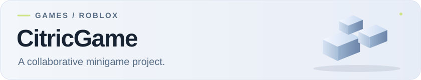

<picture>
  <source media="(prefers-color-scheme: dark)" srcset="docs/assets/readme/banner-dark.svg">
  
</picture>

A Roblox minigame project I worked on with others. My part included gameplay programming and game design.

**[Play on Roblox](https://www.roblox.com/games/7199188747/Citric-Minigames)**

> [PLACEHOLDER — 10–15 second gameplay clip showing one minigame and the mechanic I programmed or designed. Name the minigame and explain my contribution in the caption.]

This repository links to the game; its scripts and assets aren't included.
